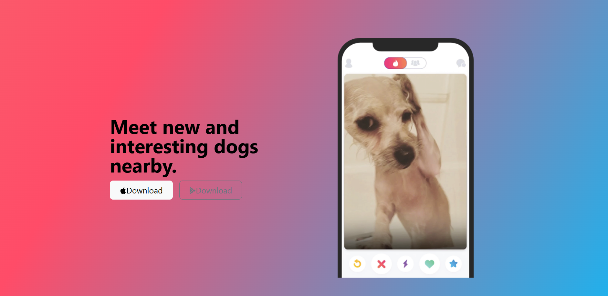

# TinDog 🐾

A fun, responsive **dating website for dogs** built with **Bootstrap**.  
This project is part of Angela Yu’s *The Complete Web Development Bootcamp*.  

The goal was to learn how to use Bootstrap’s grid system, components, and utilities to build a responsive, modern-looking landing page — while keeping it lighthearted and creative.

---

## 💻 Tech Used
- **HTML**
- **CSS**
- **Bootstrap**

---

## 🧠 What I Learned
- How to use **Bootstrap’s grid system** for layout
- How to make a **responsive website** that adapts to all screen sizes
- How to use **Bootstrap components** like cards, buttons, and navbars
- How small design tweaks (colors, spacing, typography) can completely change the vibe of a page

---

## 📸 Preview

---

## ✨ Reflection
This project was one that I truly enjoyed. It took me a long time to complete because I was trying to squeeze the most amount of juice (learning juice hehe). Bootstrap is an amzing tool and I'm excited to continue learning more about it. 🐕💕  
